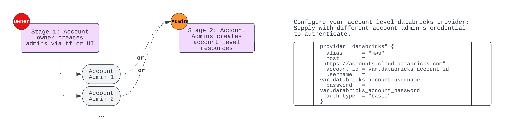

Deploy Unity Catalog with AWS Databricks Workspaces
=========================

In this template, we show a simple process to deploy Unity Catalog account level resources and infra into modules and manage your account level resources, metastores, users and groups. For Databricks official terraform samples, please refer to [Databricks Terraform Samples](
https://github.com/databricks/unity-catalog-setup)

## Context

[What is Unity Catalog?](https://docs.databricks.com/data-governance/unity-catalog/index.html)

[Terraform Guide - Set up Unity Catalog on AWS](https://registry.terraform.io/providers/databricks/databricks/latest/docs/guides/unity-catalog)

## Getting Started

We assume you have read through the official Databricks Terraform UC examples in the context links. In this tutorial, we review the concepts below:

On AWS Databricks, we have 2 levels of resources to manage:
1. Account Level (such as unity metastore, account level users/groups, etc)
2. Workspace Level (individual workspaces, workspace level users/groups, any workspace objects like clusters)

The 2 levels of resources are using different providers and have different method for authentication, username/password is the only method for account level provider authentication. 

For workspace level provider you can create `n` databricks providers for `n` existing workspaces, each provider to be authenticate via PAT token.

We propose following 2-stage process for customer to get start with UC from the very beginning. Initially you have account owner, and this identity will also be the 1st Account Admin (you can log into account console to verify). Account admin can add/remove account admins. 

We propose to use account admin identity to deploy unity catalog related resources. 
> In stage 1, you use account owner to authenticate the `mws` provider, and create additional Account Admins; you can also create account admins on UI on account console. 

> In stage 2, you use the newly created account admin identity to authenticate the `databricks mws` provider, and create the unity catalog related resources.

Refer to below diagram on the process.
bootstrapping logic to use account owner to create additional account admins. 
This is because we should not use account owner credentials in terraform project (for reasons like destroying itself will trigger issues etc).

databricks_users          = []
databricks_account_admins = ["hao.wang@databricks.com"] // use UI to remove account owner, then remove account owner from this list
unity_admin_group         = " Bootstrap admin group"
