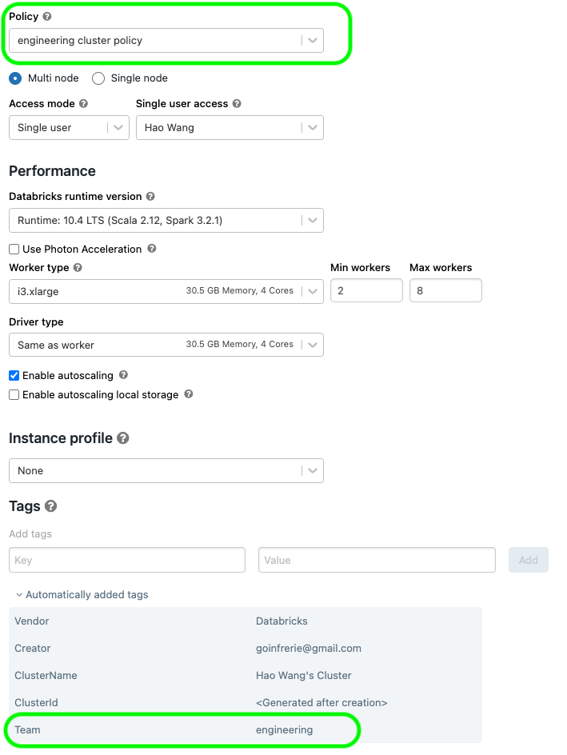
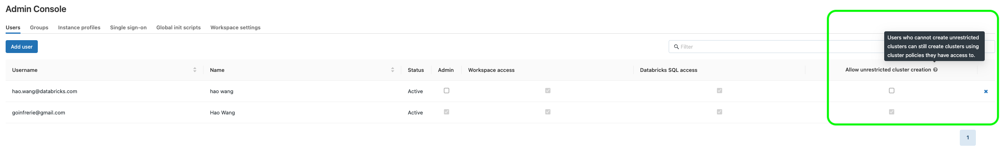

AWS Databricks workspace management using Terraform
=========================

This directory shows how to use terraform to manage workspace configurations, objects (like clusters, policies etc). We attempt to balance between configuration code complexity and flexibility. The goal is to provide a simple way to manage workspace configurations and objects, while allowing for maximum customization and governance.

### Provider configurations for multiple workspaces

Read this tutorial: https://www.terraform.io/language/modules/develop/providers

### Configure IP Access List for multiple workspaces

In this example, we show how to patch multiple workspaces using multiple json files as input; the json file contains block lists and allow lists for each workspace and we use the exact json files generated in workspace deployment template inside this repo, see this [[link](https://github.com/hwang-db/tf_aws_deployment/tree/main/aws_databricks_modular_privatelink#ip-access-list)] for more details.

Assume you have deployed 2 workspaces using the template, hence you will find 2 generated json file under `../aws_databricks_modular_privatelink/artifacts/`, and you want to patch the IP access list for both workspaces. You can refer to `main.tf` and continue to add/remove the module instances you want. For each workspace, we recommend you using a dedicated block for configuration, like the one below:

```hcl
module "ip_access_list_workspace_1" {
  providers = {
    databricks = databricks.ws1 // manually adding each workspace's module
  }

  source              = "./modules/ip_access_list"
  allow_list          = local.allow_lists_map.workspace_1
  block_list          = local.block_lists_map.workspace_1
  allow_list_label    = "Allow List for workspace_1"
  deny_list_label     = "Deny List for workspace_1"
}
```

Note that we also passed in the labels, this is to prevent strange errors when destroying IP Access Lists. This setup has been tested to work well for arbitrary re-patch / destroy of IP Access lists for multiple workspaces.

About the Host Machine's IP - this template will automatically add the host (the machine that runs this terraform script) public IP into the allow list (this is required by the IP access list feature).

You need to explicitly pass in the provider information for each instance of module, such that the resources know where to be deployed. 

### Workspace Object Management

We show how to create cluster from terraform `clusters.tf`. You can also create other objects like jobs, policies, permissions, users, groups etc.

### Cluster Policy Management

[Tagging from cluster policy](https://registry.terraform.io/providers/databricks/databricks/latest/docs/resources/cluster_policy)

By defining in the cluster policy json like below, you can enforce default tags from policy:

    "custom_tags.Team" : {
      "type" : "fixed",
      "value" : var.team
    }



Ordinary (non-admin) users, by default will not be able to create unrestricted clusters; if allowed to create clusters, they will only be able to use the policies assigned to them to spin up clusters, thus you can have strict control over the cluster configurations among different groups. See below for and example of ordinary user created via terraform.



